# Hi There 

My name is Hans Jakob Emmel. I'm from Brazil, living in Australia and _currently relentlessly driving towards the future to make education great as software engineer at [Xplor](https://ourxplor.com/) :rocket:_.

## 🔧 Technologies & Tools

## :blue_book: Medium Activity

<!-- MEDIUM:START -->
- [Moving countries during the pandemic](https://hjemmel.medium.com/moving-countries-during-the-pandemic-5f0ac33e00f4?source=rss-a11e11ccf41a------2)
- [Dealing with loss](https://hjemmel.medium.com/dealing-with-loss-4f676797d591?source=rss-a11e11ccf41a------2)
- [Gmail filters as a code](https://medium.com/swlh/gmail-filters-as-a-code-670fd719f473?source=rss-a11e11ccf41a------2)
- [How was to start a new job during the isolation](https://hjemmel.medium.com/how-was-start-a-new-job-during-the-isolation-82146b13dc27?source=rss-a11e11ccf41a------2)
- [Updating dependencies automatically](https://medium.com/swlh/updating-dependencies-automatically-4a765307117a?source=rss-a11e11ccf41a------2)
<!-- MEDIUM:END -->

## &#x1f4c8; GitHub Stats

  

 

